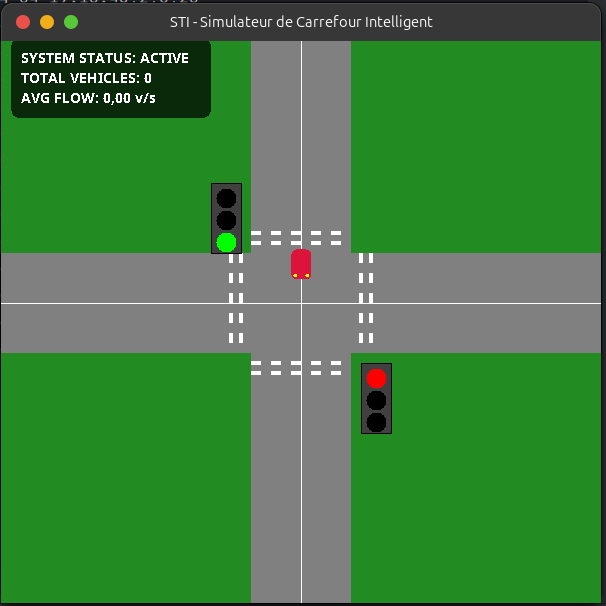

# 🚦 Intelligent Traffic Control System (JADE MAS)


<details>
<summary>Table of Contents</summary>

1. [📌 Project Overview](#-project-overview)
2. [👁️ Preview](#️-preview)
3. [✨ Key Features](#-key-features)
4. [🏗️ Project Architecture & Component Details](#️-project-architecture--component-details)
5. [⚙️ Prerequisites](#-prerequisites)
6. [🚀 Setup & Run Instructions](#-setup--run-instructions)
7. [📊 Data Logging & Analytics](#-data-logging--analytics)
8. [🤝 Contributing](#-contributing)
9. [📄 License](#-license)

</details>

<a id="-project-overview"></a>

## 📌 Project Overview

This project is an advanced **Multi-Agent System (MAS)** created using the [JADE](https://jade.tilab.com/) framework. Its primary purpose is to simulate, monitor, and optimize physical traffic flow at a two-axis intersection (`Axe_A` and `Axe_B`). Through decentralized, intelligent agent negotiation, the traffic lights autonomously coordinate to maximize throughput, while safely yielding immediate priority to emergency vehicles (e.g., ambulances) attempting to cross the intersection.

<a id="️-preview"></a>

## 👁️ Preview

Below is a live screenshot of the running Real-Time Swing Dashboard representing the smart intersection in action.


<a id="-key-features"></a>

## ✨ Key Features

- **Decentralized Traffic Coordination**: Traffic lights operate as independent autonomous agents, dynamically negotiating green light cycles with their cross-axis partners via JADE ACL messaging to ensure collision-free traffic flow.
- **Emergency Vehicle Override**: Ambulance agents possess the capability to bypass standard queuing logic, broadcasting an `EMERGENCY` message to their target traffic light. This instantly triggers a force-green state, halting cross traffic until the ambulance clears the intersection.
- **Dynamic Traffic Generation**: The system features a built-in event simulator that continuously creates vehicles at random intervals with realistic statistical distributions (90% standard cars, 10% ambulances).
- **Live GUI Monitoring Dashboard**: Provides a smooth real-time visual representation (Java Swing, 60 FPS animation, customized double-buffering) that reflects the individual traffic light states (`GREEN`, `RED`), simulated vehicles in transit, and queue structures on all axes.
- **Metric Tracking & Analytics**: A dedicated Supervisor tracks system-wide throughput, reporting KPIs like total processed vehicles and volumetric flow (vehicles per second) in the console and exporting them continuously to a `.csv` log.

<a id="️-project-architecture--component-details"></a>

## 🏗️ Project Architecture & Component Details

The simulation leverages multiple focused agent classes working harmoniously.

- `TrafficLightAgent.java` (The Core Manager)
  - Controls the physical intersection for a given axis. Tracks `waitingCars` locally.
  - **Communication**: Submits `ACLMessage.QUERY_IF` messages to its mapped partner agent to safely transition to a `GREEN` cycle upon receiving an `ACLMessage.CONFIRM`. Handles immediate `EMERGENCY` alerts bounding cross-traffic.
- `CarAgent.java` & `AmbulanceAgent.java` (The Vehicles)
  - Spawns dynamically dynamically on an axis. Informs the corresponding `TrafficLightAgent` of their arrival (`CAR_ARRIVED`). `AmbulanceAgent` additionally asserts an `EMERGENCY` priority message to disrupt normal cycle logic.
- `TrafficGeneratorAgent.java` (The Spawner)
  - Utilizes JADE's `TickerBehaviour` (every 2 seconds) to randomly determine the simulation's event flow. Creates the distinct instances using the JADE `ContainerController` and signals the `TrafficGUI` to animate the spawned vehicle elements visually.
- `SupervisorAgent.java` (The Monitor)
  - Subscribes to statistical `RELEASED:<count>` reports from the traffic lights. Aggregates intersection metrics over time to calculate actual traffic flow logic and dumps KPIs for analysis.
- `TrafficGUI.java` (The Display)
  - The single source-of-truth visualization board utilizing multithreading logic and Concurrent Collections (`CopyOnWriteArrayList`) to safely render animated state transitions without data race conditions or screen tearing.

<a id="-prerequisites"></a>

## ⚙️ Prerequisites

Before running the project, ensure you have the following installed:

- **Java Development Kit (JDK) 21** or higher.
- **Apache Maven 3.11.0** (or similar compatible 3.x+).
- _Optional but recommended_: An IDE like IntelliJ IDEA or VS Code, configured for Java development workspaces.

<a id="-setup--run-instructions"></a>

## 🚀 Setup & Run Instructions

The project relies on Maven to handle build phases and directly execute the JADE main bootloader.

```bash
# 1. Clone the repository
git clone https://github.com/yourusername/SMA_Traffic_Control.git
cd SMA_Traffic_Control

# 2. Compile the project files
mvn clean install

# 3. Launch the Multi-Agent Simulation
mvn exec:java
```

Once running, the bootloader automatically sets up the local host platform, the JADE RMA (Remote Monitoring Agent) panel, the graphical animated interface `TrafficGUI` window, and spawns the 4 permanent core agents (`Axe_A`, `Axe_B`, `Superviseur`, `Generateur`) defined within the `pom.xml` execution argument tags.

<a id="-data-logging--analytics"></a>

## 📊 Data Logging & Analytics

The `SupervisorAgent` actively logs tracking information to a file called `simulation_stats.csv` placed at the root level of your workspace. Each entry is time-stamped alongside running accumulation numbers for flow and volume monitoring:

```csv
2023-11-20 14:02:10;42;1.25
2023-11-20 14:02:22;57;1.20
```

<a id="-contributing"></a>

## 🤝 Contributing

1. Fork the repository.
2. Create your feature branch (`git checkout -b feature/AmazingFeature`).
3. Commit your changes (`git commit -m 'Add some AmazingFeature'`).
4. Push to the branch (`git push origin feature/AmazingFeature`).
5. Open a Pull Request!

<a id="-license"></a>

## 📄 License

This project is licensed under the MIT License - see the LICENSE file for details.
